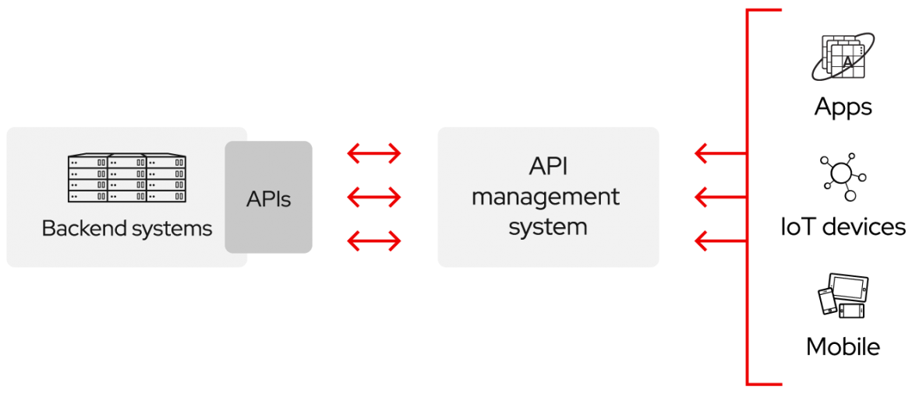
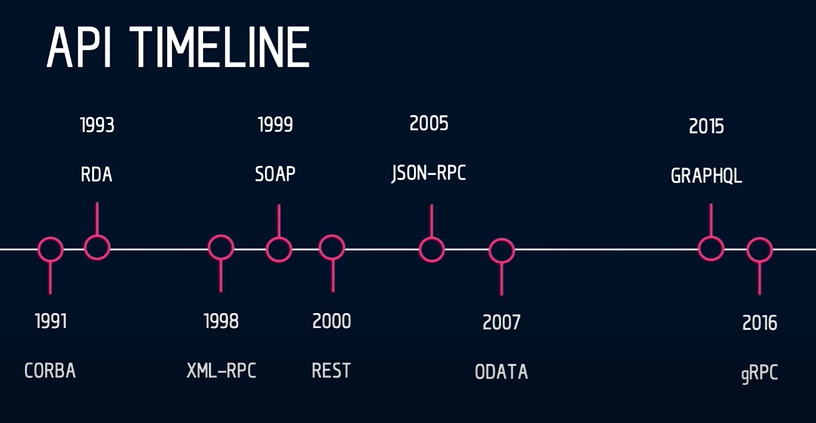
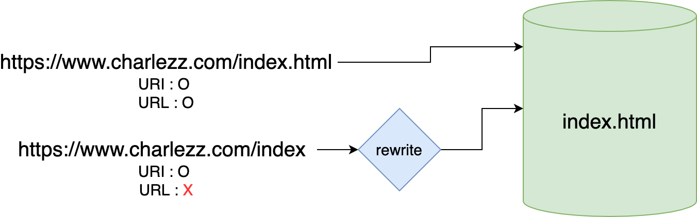

# API란?

날짜: 2023/04/26
담당자: 명빈

# API

### API가 뭐..라고 생각하십니까 ?

### 컴퓨터들간의.. 화합? 호흡 ?

## 아니.

# API란?

---



<aside>
💡 API는 애플리케이션 소프트웨어를 빌드하고 통합하기 위한 정의 및 프로토콜 세트인 애플리케이션 프로그래밍 인터페이스(Application Programming Interface)를 뜻합니다.

</aside>

출처: [Redhat](https://www.redhat.com/ko/topics/api/what-are-application-programming-interfaces)

<aside>
💡 API는 정의 및 프로토콜 집합을 사용하여 두 소프트웨어 구성 요소가 서로 통신할 수 있게 하는 메커니즘입니다.

</aside>

출처: [Amazon](https://aws.amazon.com/ko/what-is/api/)

## API 사용 시 장점

---

**기술적 장점**

- 구현 방식을 알지 못하는 제품 또는 서비스와도 통신할 수 있음.
- 애플리케이션 개발을 간소화하여 **시간과 비용을 절약**
- **유연성**을 높이고 설계, 관리, 사용 방법을 간소화
- **액세스 범위**를 넓히며 **보안과 제어**를 유지 가능.

**사업적 장점**

- 인지도 증가
- 애플리케이션의 ecosystem 구축 가능

# API 구현 방식의 발전

---



## RPC(Remote Procedure Call) Pattern

---

두 프로세스들이 같은 시스템에 있거나 다른 시스템에 존재하며 네트워크가 둘을 연결하는 형태. 소켓통신이랑 다르게 어플리케이션 계층 소통임.

(호출하는 프로세스랑 호출된 프로세스가 같은 주소 공간에 존재하지 않음) 

**원격 프로시저 호출 →** 클라이언트가 서버에서 함수나 프로시저를 완료 → 서버가 출력을 클라이언트로 다시 전송

### 장점

- Straightforward하고 단순한 상호작용
- 함수 추가가 쉬움
- 고성능

### 단점

- 시스템과 tight하게 결착 → 재사용성 낮음
- 함수 추가가 너무 용이해서 겹치는 함수가 너무 많이 생김

## SOAP(Simple Object Access Protocol) API

---

**단순 객체 접근 프로토콜** (SOAP는 이 자체로 프로토콜임.)

- XML을 사용하여 메시지를 교환
- ACID 준수 (REST API보다 더 많은 표준들이 정해져 있음.) → 데이터의 무결성 지켜짐 →
보안 수준이 엄격
- 그래서 기업에서 사용됨 (eg. 은행..)
- SOAP는 아래의 RPC 패턴을 이용함.

## REST API(Representational State Transfer)

---

**REST는 API 작동 방식에 대한 조건을 부과하는 소프트웨어 아키텍쳐**

- 정적이며 확장가능한 분산시스템을 가져올 수 있는 소프트웨어 아키텍처 디자인 제약의 모음 → 
제약들을 준수했을 때 그 시스템은 RESTful하다
- URI(통합 자원 식별자 혹은 인터넷 식별자) + HTTP 기반 → 단순함.
- 오늘날 웹에서 볼 수 있는 가장 많이 사용되고 유연함.(호환성이 좋고, 성능과 확장성이 뛰어남)
- 클라이언트가 서버에 요청을 데이터로 전송 → 서버가 내부 함수를 시작 → 출력 데이터를 다시 클라이언트에 반환

### 단점

- 표준이 자체가 존재하지 않아 정의가 필요하다.
- 사용할 수 있는 메소드가 4가지밖에 없다.
- HTTP Method 형태가 제한적이다.
- 브라우저를 통해 테스트할 일이 많은 서비스라면 쉽게 고칠 수 있는 URL보다 Header 정보의 값을 처리해야 하므로 전문성이 요구된다.

<aside>
💡 URI: Uniform resource identifier(통합 자원 식별자)

</aside>

<aside>
💡 URL: Uniform resource locator(통합 자원 지시자)

</aside>

URL **⊂** URI




URI는 **식별!** 해준다는 게 중요함. .html이나 .pdf 등이 붙지 않아도 URI가 될 수 있음.

헷갈리면 [여기](https://stackoverflow.com/questions/176264/what-is-the-difference-between-a-uri-a-url-and-a-urn)

### REST API의 제약 조건 6가지

- Server-Client 구조
- Stateless(무상태)
- Cacheable(캐시 처리 기능)
- Layered System(계층화)
- Code-On-Demand(Optional)
- Uniform Interface(인터페이스의 일관성)

### REST API 서버

```jsx
app.get("/books/:id", function (req, res) {
  const { id } = req.params;

  // 다른 요청 처리 ..

  const result = {
    title: "Romance of the Three Kingdoms",
    author: {
      firstName: "Luo",
      lastName: "Guanzhong",
    },
  };

  res.send(result);
});

```

### REST API 클라이언트 요청

```jsx
// GET /books/1

fetch("localhost:3000/books/1")
.then((response) =>console.log(response));
```

### REST API 응답

```jsx
Response {status: 200, ok: true, redirected: false, type: "cors", url: "localhost:3000/api/user", …}

// {
//  "title": "Romance of the Three Kingdoms",
//  "author": {
//    "firstName": "Luo",
//    "lastName": "Guanzhong"
//  }
//}
```

## GraphQL

---

GraphQL에서는 API서버에서 정의된 endpoint 들에 요청하는 대신 한번의 요청으로 가져오고 싶은 데이터를 가져올 수 있게 해 줌.

- REST에서는 Resource에 대한 형태 정의와 데이터 요청 방법이 연결되어 있지만, GraphQL에서는 Resource에 대한 형태 정의와 데이터 요청이 완전히 분리됨

### 단점

- 재귀적인 쿼리가 불가능하다. 결과에 따라 응답의 깊이가 얼마든지 깊어질 수 있는 API를 만들 수 없음
- 고정된 요청과 응답만 필요한 경우 쿼리로 인해 요청의 크기가 REST API의 경우보다 더 커진다고 한다.

### GraphQL 서버

```jsx
// Resolver is a collection of functions that generate
// response for a GraphQL query.
const resolvers = {
  Query: {
    book: (parent, args) => {
      // 다른 요청 처리 ..

      const result = {
        title: "Romance of the Three Kingdoms",
      };
      return result;
    },
    author: (parent, args) => ({ firstName: "Luo", lastName: "Guanzhong" }),
  },
};
```

### GraphQL 클라이언트 요청

```jsx
query {
  book(id: "1") {
    title
    author {
      firstName
      lastName
    }
  }
}

//{
//  "title": "Romance of the Three Kingdoms",
//  "author": {
//    "firstName": "Luo",
//    "lastName": "Guanzhong"
//  }
//}
```

## Websocket API

---

웹 소켓은 사용자의 브라우저와 서버 사이의 인터액티브 통신 세션을 설정함.

웹 소켓 API를 통해 서버로 메시지를 보내고 서버를 폴링*하지 않고도 이벤트 중심 응답을 받는 것이 가능

* 폴링은 리얼타임 웹을 위한 기법으로, 일정한 주기(특정한 시간)을 가지고 서버와 응답을 주고 받는 방식을 말함.

- JSON 객체를 사용하여 데이터를 전달
- 클라이언트 앱과 서버 간의 양방향 통신을 지원
- 서버가 연결된 클라이언트에 콜백 메시지를 전송  가능 → REST API보다 효율적

### 단점

- 연결을 유지해야하기 때문에 부하가 발생할 수 있음
- 비정상적으로 연결이 끊어졌을 때(새로고침, 페이지 닫기 등) 적절한 대응이 필요

```jsx
// WebSocket 연결 생성
const socket = new WebSocket('ws://localhost:8080');

// 연결이 열리면
socket.addEventListener('open', function (event) {
    socket.send('Hello Server!');
});

// 메시지 수신
socket.addEventListener('message', function (event) {
    console.log('Message from server ', event.data);
});
```

## REST vs GraphQL

---

- REST에서는 Resource에 대한 형태, 데이터 요청 방법이 연결되어 있지만, GraphQL에서는 Resource에 대한 형태 정의와 데이터 요청이 완전히 분리. GraphQL에서는 필요한 크기와 형태는 client단에서 요청 시 결정
- REST에서는 여러 Resource에 접근할 때 여러 번의 요청이 필요하지만, GraphQL에서는 한번의 요청에서 여러 Resource에 접근 가능


# 출처

---

API란?

[https://www.redhat.com/ko/topics/api/what-are-application-programming-interfaces](https://www.redhat.com/ko/topics/api/what-are-application-programming-interfaces)

[https://aws.amazon.com/ko/what-is/api/](https://aws.amazon.com/ko/what-is/api/)

비교

[https://www.altexsoft.com/blog/soap-vs-rest-vs-graphql-vs-rpc/](https://www.altexsoft.com/blog/soap-vs-rest-vs-graphql-vs-rpc/)

[https://www.upwork.com/resources/soap-vs-rest-a-look-at-two-different-api-styles](https://www.upwork.com/resources/soap-vs-rest-a-look-at-two-different-api-styles)

Websocket

[https://developer.mozilla.org/ko/docs/Web/API/WebSocket](https://developer.mozilla.org/ko/docs/Web/API/WebSocket)

GraphQL

[https://graphql.org/code/#javascript](https://graphql.org/code/#javascript)

[https://graphql-kr.github.io/learn/queries/](https://graphql-kr.github.io/learn/queries/)

REST API vs GraphQL

[https://hwasurr.io/api/rest-graphql-differences/](https://hwasurr.io/api/rest-graphql-differences/)

URL vs URI

[https://www.charlezz.com/?p=44767](https://www.charlezz.com/?p=44767)

[https://stackoverflow.com/questions/176264/what-is-the-difference-between-a-uri-a-url-and-a-urn](https://stackoverflow.com/questions/176264/what-is-the-difference-between-a-uri-a-url-and-a-urn)