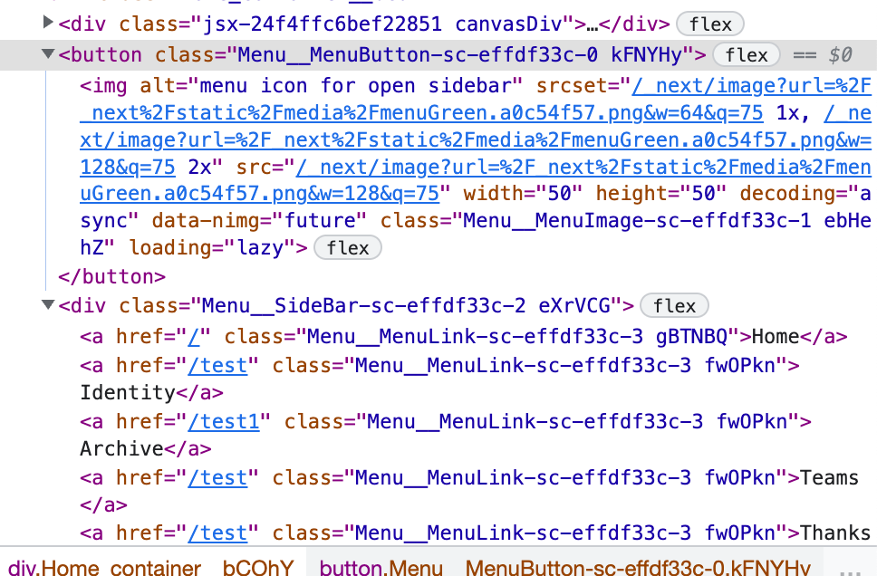

## CSS-in-JS(styled-components)에 대해 알아보자.

발표자 : 윤석

## inline style 사용하지 말아야 할 이유
CSS를 다 활용할 수 없다.

아래의 예시는 사용 못함.

ex) 가상 선택자, media, keyframes

## 그렇다면 CSS-in-JS ?

CSS-in-JS는 javascript를 통해서 CSS를 적용하는 기술.

CSS-in-JS에서는 기존 inline style에서 불가능 했던 것들을 지원함.

개발 측면에서 재사용성, 생산성이 높다.

CSS 파일 관리 측면에서 CSS 충돌 예방, 파일(코드) 위치 자유도 높다.


``` javascript
import styled from 'styled-components';

const Box = styled.div`
  background-color: papayawhip;

  /* Pseudo selectors! */
  &:after {
    content: "";
    display: table;
    clear: both;
  }

  /* Media queries! */
  @media screen and (min-width: 750px) {
    background-color: seagreen;
  }
`;
```

## CSS-in-JS의 동작원리
여기선 CSS-in-JS의 대표적인 라이브러리인 styled-components에 대해 알아볼 것이다.

### *styled*; styled-component의 핵심

es6 문법의 Tagged Template Literal
``` javascript
const name = 'John'
const location = 'seoul'

const tag = (strs, firstExpr, secondExpr) =>
  console.log(strs, firstExpr, secondExpr)

tag`나는 ${location}에 살고있는 ${name}이야`
// ["나는 ", "에 살고있는 ", "이야"], "seoul", "john"
```

기본적인 styled 구조
``` javascript
import React, { useRef, useEffect } from 'react'

const myStyled = (TargetComponent) => ([style]) => props => {
  const elementRef = useRef(null)

  useEffect(() => {
    elementRef.current.setAttribute('style', style)
  }, [elementRef])

  return <TargetComponent {...props} ref={elementRef} />
}

export default myStyled

// index.js
const Button = myStyled('button')`
  color: red;
  border: 2px solid red;
  border-radius: 3px;
`

ReactDOM.render(<Button>Submit</Button>, rootElement)
```
=> 해당 구조는 props를 이용한 동적인 업데이트는 불가능.

``` javascript
// myStyled.js
import React, { useRef, useEffect } from 'react'

const myStyled = (TargetComponent) => (strs, ...exprs) => props => {
  const elementRef = useRef(null)

  // NEW!
  useEffect(() => {
    const style = exprs.reduce((result, expr, index) => {
      const isFunc = typeof expr === 'function'
      const value = isFunc ? expr(props) : expr

      return result + value + strs[index + 1]
    }, strs[0])

    elementRef.current.setAttribute('style', style)
  })

  return <TargetComponent {...props} ref={elementRef} />
}

export default myStyled

// index.js
const Button = myStyled('button')`
  color: ${props => (props.color ? props.color : 'red')};
  border: 2px solid red;
  border-radius: 3px;
`

ReactDOM.render(<Button color="blue">Click me</Button>, rootElement)
```
useEffect 처리를 통해서 style을 업데이트.


### 컴포넌트 렌더링까지의 과정
1. styled를 통해서 컴포넌트가 생성된다.
2. 해당 컴포넌트는 componentID로 상수를 가진다.
3. styled가 한 번씩 쓰일 때마다 componentID++
4. 컴포넌트는 component에 대한 클래스명, style에 대한 클래스명 하나씩 가진다.

`component 클래스명 = 파일명 + 본인이름 + hash(componentID)`

`style 클래스명 = hash(componentID + prop에 대한 계산이 끝난 style string)`

5. 생성된 클래스명으로 head에 style을 넣는다.
6. 컴포넌트의 className에 두 클래스명을 넣고 렌더링한다.



### attrs를 통한 최적화 꿀팁
만약 버튼을 누를 때마다 font size가 커진다면 head의 style에 계속 css 클래스가 들어간다.

왜 그럴까? ⇒ 성능 overhead를 없기 위해서.

이럴 땐 attrs을 써주는게 좋다!

``` javascript
const Button = styled.button.attrs({
  style: ({ sizeValue }) => ({ fontSize: sizeValue + 'px' })
})`
  color: coral;
  padding: 0.25rem 1rem; 
  border: solid 2px coral; 
  border-radius: 3px;
  margin: 0.5rem;
  &:hover {
    background-color: bisque;
  }
`;
```

### 참고

[inline styles vs css-in-js](https://mxstbr.blog/2016/11/inline-styles-vs-css-in-js/)

[how styled components works](https://medium.com/styled-components/how-styled-components-works-618a69970421)

[styled components는 어떻게 동작할까](https://john015.netlify.app/styled-components는-어떻게-동작할까)