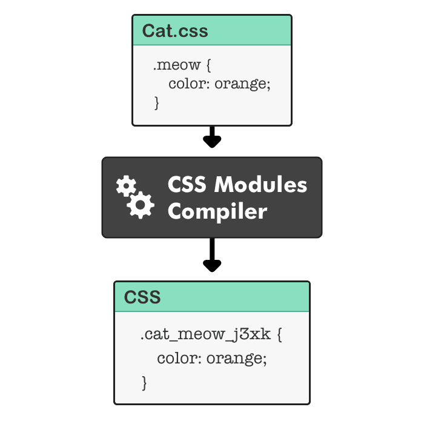

## CSS Module 동작 방식

발표자 : 윤석

CSS Module이란?

*`A CSS Module is a CSS file in which all class names and animation names are scoped locally by default.`*

여기서 scoped locally가 중요하다. 즉 CSS 적용 범위를 지역적으로 하여 파일별로 관리를 따로 함.

어떻게 작동하는지 이해하려면 CSS Module 컴파일러의 두 가지 행동을 이해해야한다.

1. CSS 파일들 안의 클래스 명을 해쉬값을 붙여 변형시킨다.
2. 모듈을 사용하는 파일에 기존 클래스명과 새로 만든 클래스명을 매칭한 객체를 보낸다.

### CSS Module 컴파일러는 클래스명에 해쉬값을 붙여 변형시킨다.



새로운 클래스명 : 파일명_기존클래스명_해쉬값

이를 통해 전역으로 새로운 클래스를 생성한다.

### 모듈을 사용하는 파일에 기존 클래스명과 새로 만든 클래스명을 매칭한 객체를 보낸다.

우리가 실제 사용할 때의 코드를 보며 어떻게 변형 된 className을 가질 수 있는지 알아보자.

``` javascript
// TestCSS.css
.button {
	border: 1px;
}


// Test.js
import styles from './TestCSS';
/*
styles = {
	button: 'TestCSS_styles_abc123'
}
*/

const Test = () => {
	return <button className={styles.button}>hi</button>
}

export default Test;

```

CSS Module을 통해 전달받은 styles는 기존 클래스명과 새로운 클래스명을 매칭한 객체이다. 이렇게 우리는 CSS Module을 통해서 지역적으로 처리한 CSS를 사용할 수 있게 된다!

---

CSS-in-CSS( ex: Sass ) 같은 경우, CSS Module 없이 별개로 작동은 한다. 변수, 중첩 규칙 등으로 CSS 문법을 확장한 것.

참고 및 이미지 출처

[https://www.javascriptstuff.com/what-are-css-modules/](https://www.javascriptstuff.com/what-are-css-modules/)

